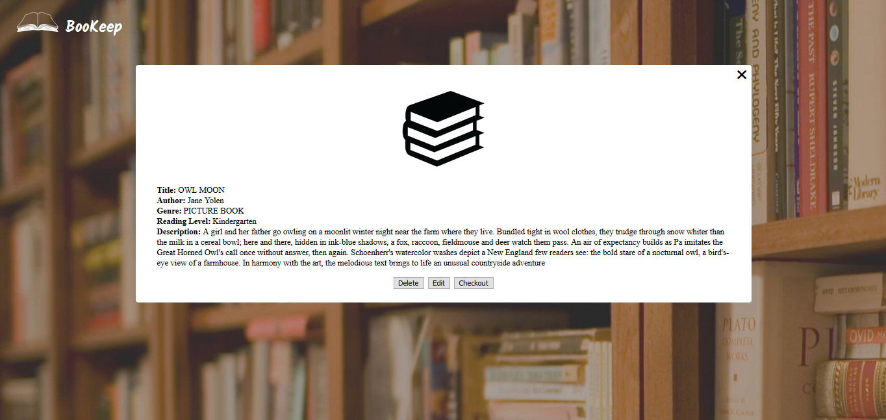

## BooKeep

## Motivation
Elementary school teachers have their hands full! Whether it's wrangling kids or going to team meetings, they hardly have time to think about the little things in their class. I designed BooKeep to help teachers manage their library. Teachers need to come up with a book idea for a student on the fly, BookKeep does that. Teachers need to reference their library in meetings, BooKeep doest that. Teachers need to be able to check out their classes, BooKeep does that. While BooKeep was built with teachers in mind, it can be used by anyone to manage their libraries.

## Demo
Live app: https://infinite-river-85875.herokuapp.com/

## Screenshots

## Technologies Used
Node, Express, JQuery, JavaScript, MongoDB, Mongoose, Mocha, Chai, REST APIs

## Restful API

# GET
- /getBooks -> Retrieves all books
- /getbooks/byTitle/:title -> Retrieves books by title
- /getbooks/bygenre/:genre -> Retrieves books by Genre
- /getbooks/byID/:id -> Retrieves books by id
- /getbooks/checkedout -> Retrieves all checkedout books

# POST
 - /add -> Creates a new book

# PUT
- /update/:id -> Updates a book information
- /checkout/:id -> Updates a books checked out status

# DELETE
- /delete/:id -> Finds book by ID and deletes it

## Future Enhancements
- Allow for searches by other book parameters
- Allow for random search by multiple book parameters
- Integrate third party API to allow for more robust add a book feature

- Allow for 
